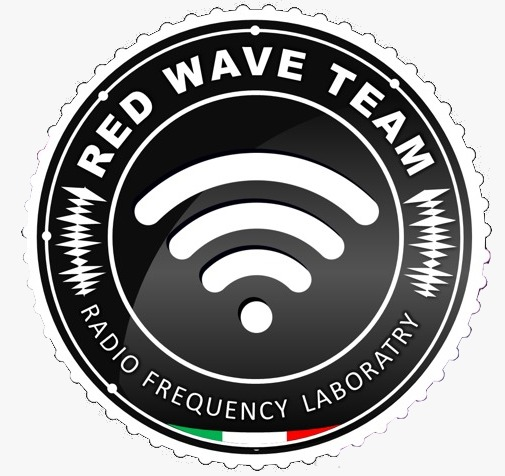

# Abbiamo recentemente pubblicato una **rubrica approfondita sul Wi-Fi** su RedHotCyber.

Per scoprire tutti i dettagli e leggere l'articolo completo, visita il seguente link:

[I nostri articoli](https://www.redhotcyber.com/rubriche/alla-scoperta-del-wi-fi-attacco-e-difesa-delle-moderne-reti-wireless/)

[Wi-Fi](https://www.redhotcyber.com/post/il-pericolo-delle-password-di-default-usiamo-wireshark-ed-hashcat-per-testare-la-sicurezza-del-modem/)

[Il Wi-Fi: dalle origini di Marconi alla rete senza fili che conosciamo oggi](https://www.redhotcyber.com/post/il-wifi-dalle-origini-di-marconi-alla-rete-senza-fili-che-conosciamo-oggi/)

RedWave Team è un gruppo di esperti in cybersecurity e reti WiFi della community di Red Hot Cyber, con competenze sia offensive che defensive. Offre una visione completa e multidisciplinare del panorama della sicurezza informatica. Coordinato da Roland Kapidani, Il gruppo è composto da Cristiano Giannini, Francesco Demarcus, Manuel Roccon, Marco Mazzola, Matteo Brandi, Vincenzo Miccoli, Pietro Melillo.