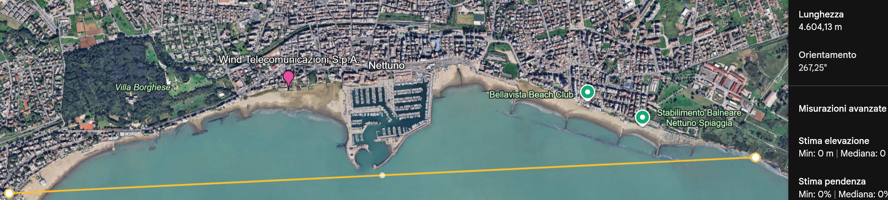

# Pentesting Wi-Fi mobile a lunga distanza 

# Test sul campo: strumenti e metodologia

Per i test descritti in questo articolo ho utilizzato strumenti di scansione consolidati (Kismet e airodump-ng) combinati con un setup mobile basato su Kali NetHunter. L'obiettivo era effettuare una ricognizione non invasiva delle reti visibili e verificare la massima distanza di rilevamento in condizioni reali.

## Hardware e componenti usati:

* **Dispositivo:** Nexus 6P con Kali NetHunter installato.
* **Collegamento:** cavo USB‑C OTG.
* **Adattatore Wi‑Fi USB:** TP‑Link TL‑WN722N V1 (chipset compatibile con modalità monitor/injection nelle versioni V1).
* **Antenna:** antenna direzionale 

## Software usato:

* **Kismet** (per la raccolta passiva e la mappatura delle reti)
* **airodump‑ng** (per liste SSID/BSSID e misurazioni RSSI)

1. Avvio delle sessioni di Kismet e airodump‑ng per la raccolta passiva delle reti visibili.
2. Confronto delle posizioni (coordinate o punti di riferimento) per concludere la distanza stimata 
3. visualizzare le reti su wigle / google earth

Con l'antenna direzionale e il TL‑WN722N V1 sono riuscito a rilevare reti a oltre 4 km di distanza, verificandolo sia tramite la mappa di Wigle sia direttamente sul posto.

continua ...