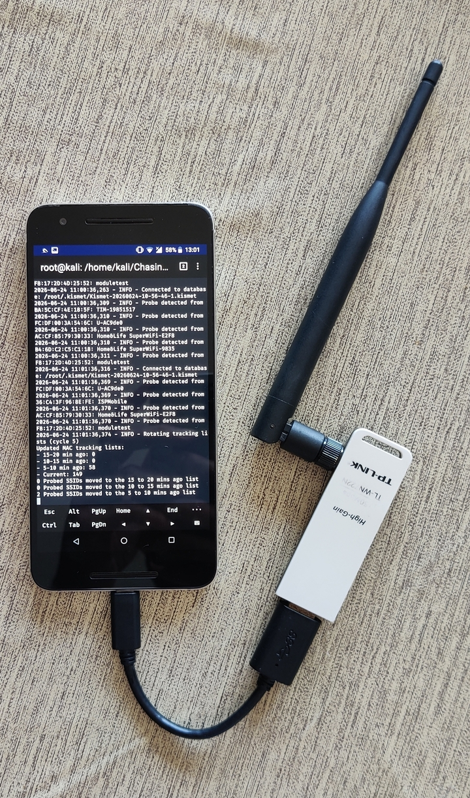
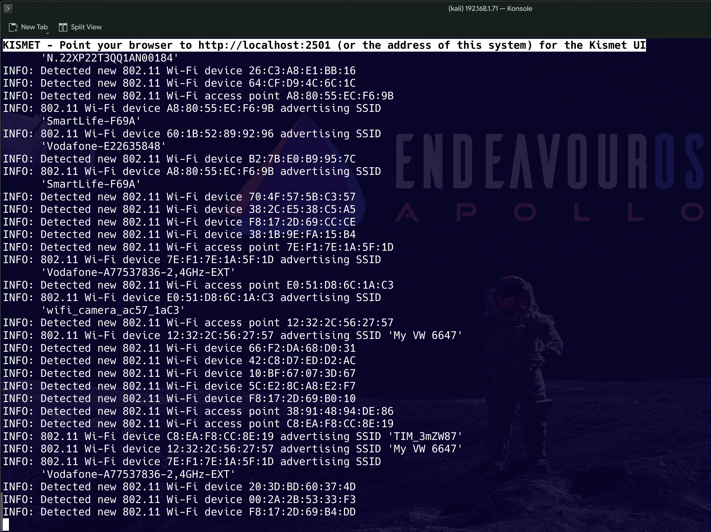
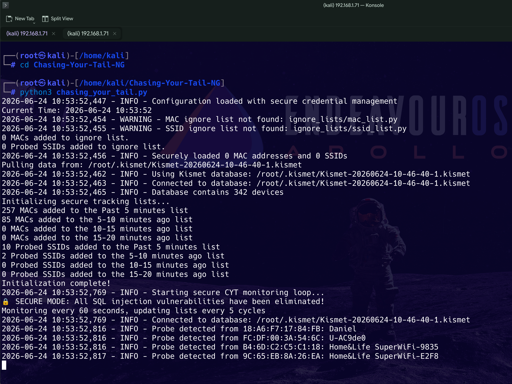
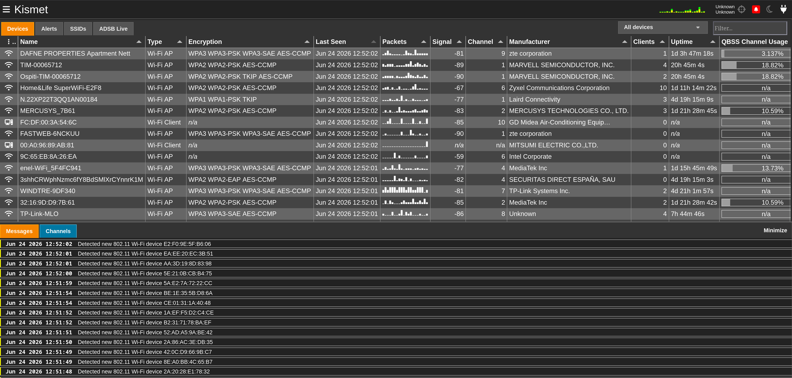
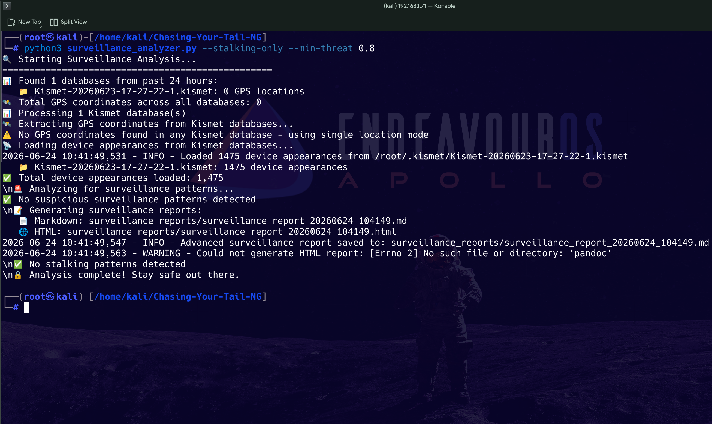
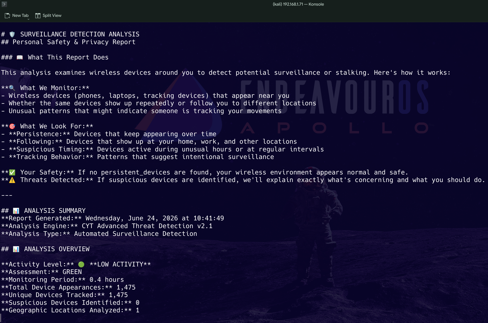

 
 # Chasing Your Tail – Come capire se qualcuno ti segue analizzando le reti Wi-Fi

Chasing Your Tail è uno strumento progettato per analizzare dati provenienti da Kismet e aiutare a comprendere la presenza e la persistenza dei dispositivi Wi-Fi nell’ambiente nel tempo.

Il progetto nasce con l’obiettivo di osservare come i dispositivi radio compaiono e si ripresentano nel tempo, utilizzando una suddivisione temporale dei dati raccolti.

🔍 Come funziona

Lo strumento organizza i dispositivi rilevati in finestre temporali progressive:

Current (rilevati in tempo reale)

5–10 minuti fa

10–15 minuti fa

15–20 minuti fa

Questo permette di analizzare la continuità dei dispositivi nel tempo e individuare eventuali pattern di presenza ripetuta.

## 📡 Probe Wi-Fi e comportamento dei dispositivi

I dispositivi Wi-Fi inviano periodicamente probe request, ovvero richieste automatiche utilizzate per cercare reti disponibili nell’ambiente circostante

Questi dati vengono utilizzati per osservare:

l’attività radio dei dispositivi
la frequenza con cui vengono inviate le richieste di rete
la ripetizione nel tempo dello stesso MAC address

## 🧠 Interpretazione dei dati

L’analisi non identifica persone, ma dispositivi Wi-Fi.

Un dispositivo può essere considerato “persistente” quando appare in più finestre temporali consecutive.

In uno scenario reale, una persona che si sposta tende spesso a portare con sé uno o più dispositivi che emettono segnali radio, come smartphone, smartwatch, tablet, dispositivi Bluetooth o altri apparati wireless.

È importante considerare che:

i dispositivi moderni utilizzano MAC randomizzati
la presenza di un MAC non equivale all’identificazione di una persona
l’ambiente Wi-Fi può contenere numerosi dispositivi simultaneamente

## 📊 Analisi dei pattern di mobilità

Un concetto interessante, discusso anche da esperti di digital forensics durante conferenze come Black Hat USA 2022, riguarda l’analisi della presenza dei dispositivi Wi-Fi nel tempo e in luoghi differenti.

L’idea è semplice: quando lo stesso dispositivo viene rilevato in ambienti diversi nel tempo — ad esempio in un bar, poi in un altro punto della città e successivamente in una nuova posizione — è possibile osservare una continuità di presenza che può evidenziare pattern di movimento o comportamento ricorrente.

Questo tipo di analisi non punta a identificare individui, ma a studiare le tracce radio lasciate dai dispositivi e la loro persistenza nello spazio e nel tempo.

In contesti di analisi della sicurezza wireless, un singolo individuo può operare più dispositivi contemporaneamente.

Ad esempio, un attore sul campo può utilizzare telefoni, tablet o dispositivi di monitoraggio, ognuno dei quali genera una firma radio unica nell’ambiente Wi-Fi.

Queste firme, pur non identificando direttamente una persona, possono risultare persistenti o ricorrenti nel tempo e nello spazio, permettendo l’osservazione di pattern di attività multi-dispositivo.

## 🧪 Setup di test utilizzato

Per validare il comportamento dello strumento sono stati utilizzati due ambienti differenti.

## 📱 Mobile test environment (Kali NetHunter) 

Questo è il mio setup principale, che utilizzo dal 2014. È una soluzione mobile che posso portare sempre con me, anche in tasca, mantenendo capacità di analisi in mobilità.
Il primo setup è basato con un telefono e un antenna su un Nexus 6P con Kali NetHunter, utilizzato come piattaforma mobile per l’analisi del traffico Wi-Fi.

Configurazione:

Dispositivo: Nexus 6P
Sistema: Kali NetHunter
Adattatore Wi-Fi compatibile con la monitor mode TP-Link TL-WN722N V.1
Cavo otg
GPS (facoltativo)
Adattatore Bluetooth (facoltativo)

## 🧩 Embedded test environment (Hackberry Pi 5)

Il secondo setup utilizza un sistema embedded basato su Raspberry Pi 5:

👉 Hackberry Pi 5 

Configurazione:

Raspberry Pi 5

interfaccia Wi-Fi in monitor mode: L'Alfa AWUS036NHA

gps (facoltativo)
antenna bluethoot (facoltativo)

## 🔬 Scopo del setup combinato

L’utilizzo di due ambienti differenti consente di:

confrontare dati in mobilità vs statico
osservare la persistenza dei dispositivi nel tempo
validare la consistenza delle rilevazioni Wi-Fi

Dopo aver installato e configurato correttamente Kismet e Chasing Your Tail, è possibile avviare il sistema per iniziare la raccolta e l’analisi dei dati Wi-Fi in tempo reale.

Una volta attivo, lo strumento inizia a correlare i dispositivi rilevati con le finestre temporali definite, permettendo di osservare la loro presenza e persistenza nel tempo.

python3 chasing_your_tail.py

Dopo l’avvio, lo script inizia l’analisi in tempo reale dei dati provenienti da Kismet.

Durante l’utilizzo, è possibile collegarsi anche alla Kismet GUI per la visualizzazione in tempo reale delle reti rilevate.

Successivamente è possibile eseguire lo script di analisi post-cattura tramite python3 surveillance_analyzer.py, che elabora i dati raccolti e genera i report finali.

Recenti: ultimi 5 minuti – minacce immediate

Medio: 5–10 minuti fa – definizione dei modelli di attività

Vecchio: 10–15 minuti fa – conferma della persistenza

Più vecchio: 15–20 minuti fa – monitoraggio di lungo periodo

## Riepilogo

In questo tutorial abbiamo visto come utilizzare Chasing Your Tail – NG per analizzare la presenza e la persistenza dei dispositivi Wi-Fi nel tempo, sfruttando l’integrazione con Kismet e la suddivisione in finestre temporali, anche con l’obiettivo di evidenziare eventuali pattern utili a comprendere la mobilità dei dispositivi e la loro ricorrenza nell’ambiente, contribuendo ad analisi che, in determinati scenari, possono anche aiutarti a capire se qualcuno ti sta seguendo o se un dispositivo si ripresenta in modo continuo nel tempo.

Grazie per la lettura.