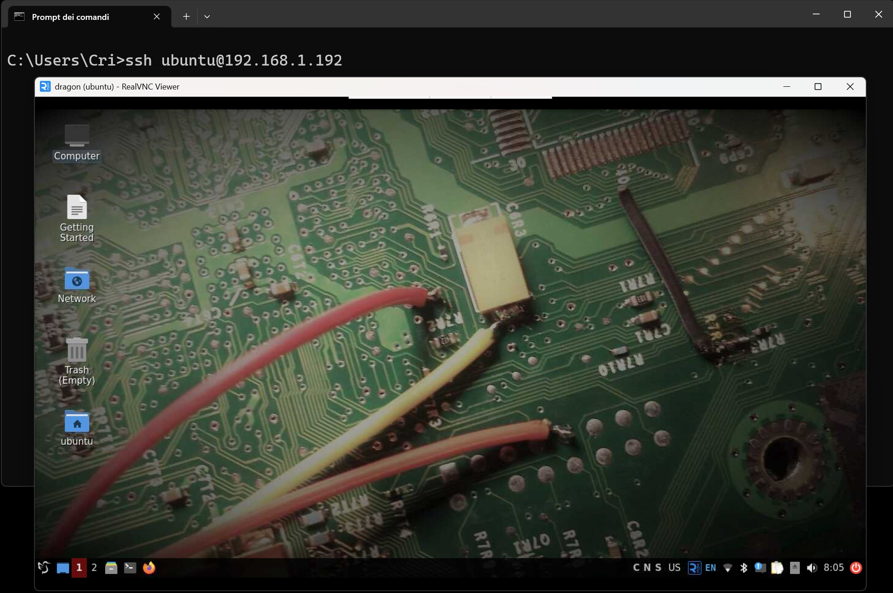
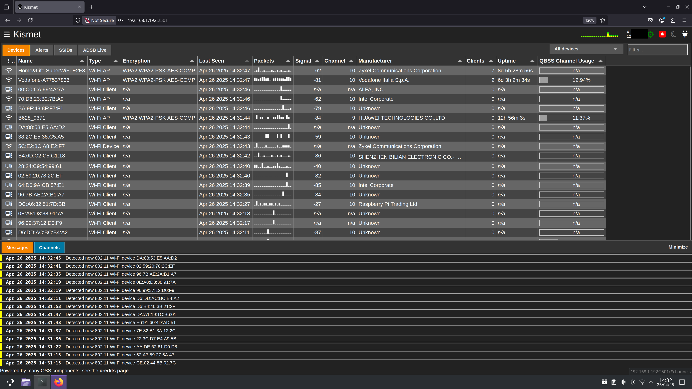

# Kismet 
## Parte 1

Kismet è uno strumento di acquisizione wireless estremamente potente e versatile, per l’analisi passiva delle reti.  
Nella sua forma moderna, **Kismet non si limita al solo Wi-Fi**, ma supporta anche altre tecnologie wireless come **Bluetooth**, **nRF**, **433 MHz**, **ADS-B**, e perfino i segnali provenienti dai contatori AMR (Automatic Meter Reading), sfruttando l’integrazione con dispositivi **SDR (Software Defined Radio)**.

In questo articolo ci concentreremo **esclusivamente sulle funzionalità Wi-Fi**, che restano il cuore pulsante del tool.

---

## 🔍 Cosa fa esattamente Kismet?

Kismet opera **in modalità passiva**, il che significa che non invia pacchetti, ma si limita ad ascoltare tutto ciò che passa “nell’aria”.  
Acquisisce i **frame wireless grezzi**, li analizza e li decodifica in tempo reale per:

- Identificare **Access Point (AP)**, anche se nascosti
- Rilevare **client associati e non associati**
- Analizzare il tipo di cifratura utilizzata (WEP, WPA, WPA2, WPA3)
- Ricostruire **topologie di rete**
- Monitorare attività sospette, come spoofing, beacon flood e altri attacchi

Kismet permette di **visualizzare e salvare i pacchetti** per analisi successive, offrendo esportazione in vari formati, inclusi **PCAP** per Wireshark.

---

## 📍 Geolocalizzazione: Kismet incontra il GPS

Se abbinato a un dispositivo GPS , Kismet include anche dati di geolocalizzazione stimati per i dispositivi rilevati.  
Questo è particolarmente utile in contesti di:

- **Wardriving**
- **Rilevamento anomalie** in aree geografiche specifiche
- **Mappatura della copertura Wi-Fi**


> 📌 Nota: La geolocalizzazione è **stimata** in base alla potenza del segnale e al momento della ricezione, ma fornisce comunque un quadro utile della disposizione spaziale delle reti.

---

## 🐉 Kismet su Raspberry Pi con DragonOS

Sto attualmente utilizzando **Kismet** su un **Raspberry Pi** equipaggiato con **DragonOS**, una distribuzione Linux ottimizzata per applicazioni **SDR** e di **sicurezza wireless**.

**DragonOS** è basata su Ubuntu ed è famosa per essere **preconfigurata** con:

- Software per Software Defined Radio (HackRF, RTL-SDR, LimeSDR, ecc.)
- Strumenti di sicurezza Wi-Fi (Wireshark, Aircrack-ng, Kismet)
- Tool di analisi RF, Bluetooth, ADS-B, e molto altro

Questa combinazione — **Kismet + Raspberry Pi + DragonOS** — permette di realizzare un **kit portatile di rilevamento wireless**, ideale per:

- Attività di **wardriving**
- Survey di reti Wi-Fi
- **Monitoraggio ambientale** di segnali wireless e altro


---

## 🚀 Come avviare Kismet su DragonOS

Una volta avviato DragonOS sul Raspberry Pi:

1. Collega una scheda Wi-Fi compatibile con la modalità monitor.
2. Apri un terminale.
3. Prima di avviare Kismet, è necessario mettere la scheda Wi-Fi in **modalità monitor**. Puoi farlo usando `airmon-ng`:

   ```bash
   sudo airmon-ng start wlan1
   sudo kismet -c wlan1mon


 mi sono collegato in remoto tramite **SSH** 

 

 o, in alternativa, utilizzando **VNC** per accedere alla macchina

 

 

Ora puoi aprire il browser e accedere all'interfaccia web:

Se sei direttamente sul Raspberry Pi: vai su http://localhost:2501

Se sei collegato da un altro computer (tramite SSH o VNC): vai su http://IP_DEL_RASPBERRY:2501

🔐 Primo accesso: impostazione della password
Al primo accesso al server web di Kismet, ti verrà richiesto di impostare una password per proteggere l'interfaccia.
Questa password verrà salvata in un file di configurazione (.kismet_httpd.conf) e sarà necessaria per accedere anche in futuro.



---

➡️ **Continua nella prossima parte!**  

