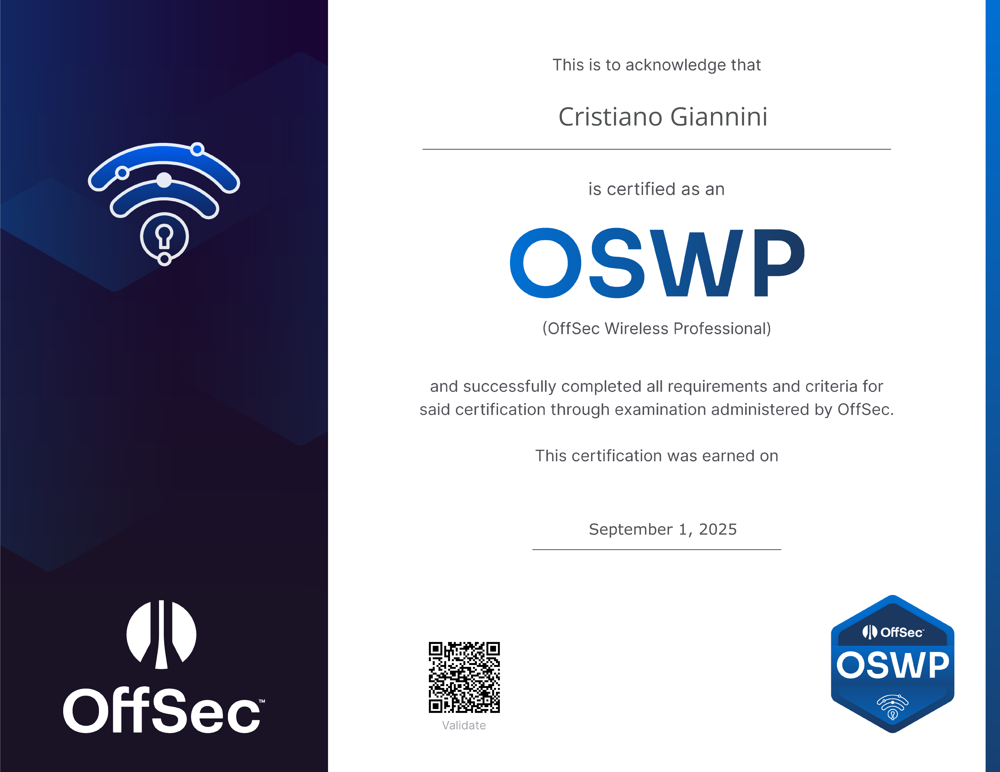
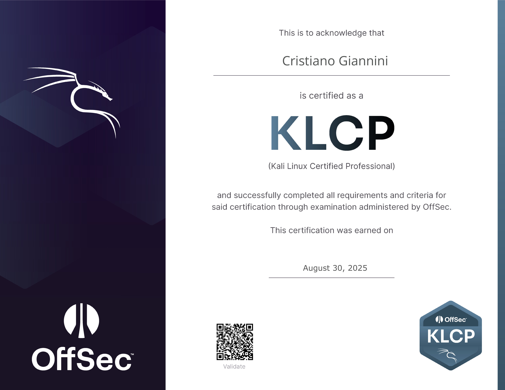

## # 🎉 Un traguardo importante

Sono entusiasta di condividere un traguardo a cui puntavo da tempo: ho ottenuto la certificazione **OSWP – Offensive Security Wireless Professional**!  

Le reti wireless sono sempre state la mia passione, e questa certificazione è da sempre la mia preferita. Dopo mesi di studio e pratica sul campo, raggiungere questo obiettivo rappresenta una grande soddisfazione personale e professionale.  

Durante il percorso ho avuto l’opportunità di approfondire:  

- Attacchi contro WEP, WPS, WPA/WPA2 (sia Enterprise che Personal)  
- Un’introduzione a WPA3  

Un ringraziamento speciale a **OffSec** per i materiali e il percorso formativo, che rendono possibile affrontare sfide reali nel campo della cybersecurity. Questa esperienza mi ha permesso di ampliare le mie conoscenze sulle tecniche avanzate di auditing e penetration testing Wi-Fi, rafforzando le mie competenze in **sicurezza offensiva**.  

## OSWP – Offensive Security Wireless Professional
 
 

**Descrizione:**  
Gli **OSWP** sono esperti nella sicurezza delle reti wireless 802.11 e sono in grado di identificare crittografie e vulnerabilità esistenti.  
Le competenze principali includono:  
- Maggiore comprensione della sicurezza offensiva wireless e della necessità di soluzioni di sicurezza concrete  
- Utilizzo di strumenti avanzati per la ricognizione wireless  
- Implementazione di attacchi contro reti crittografate WPA Personal ed Enterprise  
- Implementazione di attacchi contro reti Wireless Protected Setup (WPS) e Captive Portal  
- Capacità di decifrare hash di autenticazione e aggirare restrizioni di rete  

**Come si svolge l’esame:**  
L’esame **OSWP** è completamente pratico e consiste nel penetrare **tre reti wireless diverse** entro un limite di tempo prestabilito.  
Durante l’esame, il candidato deve:  
- Analizzare e identificare vulnerabilità sulle reti target  
- Recuperare chiavi di crittografia in uso  
- Documentare tutti gli attacchi e i risultati in un report completo da consegnare  

L’esame dimostra che gli OSWP sanno operare efficacemente in scenari reali, gestendo tempo e risorse in modo ottimale.

🛡️ Le mie certificazioni

## KLCP – Kali Linux Certified Professional
  

**Descrizione:**  
La certificazione **KLCP** attesta competenze avanzate nell’uso di Kali Linux per attività di penetration testing e sicurezza offensiva.  
I professionisti certificati sono in grado di:  
- Installare, configurare e gestire sistemi Kali Linux in ambienti complessi  
- Automatizzare compiti di sicurezza tramite scripting  
- Gestire utenti, processi e permessi di sistema in modo sicuro  
- Comprendere e applicare strumenti di sicurezza di rete e di sistema  

L’esame verifica sia conoscenze teoriche che capacità pratiche, dimostrando la capacità di operare in scenari reali con precisione e autonomia.

