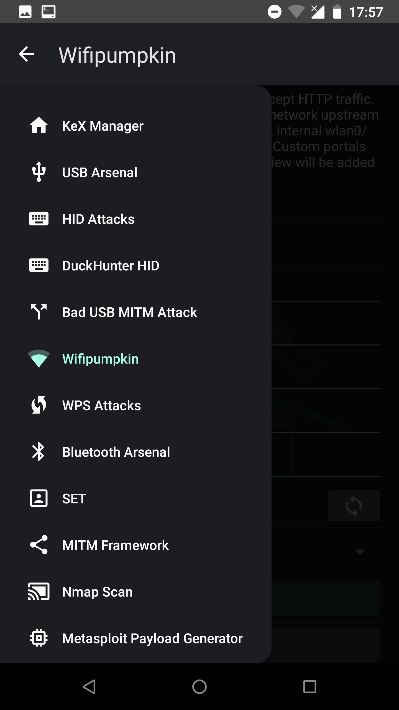
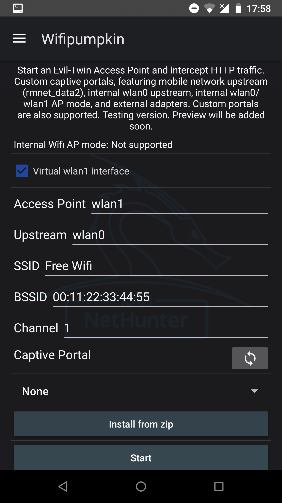
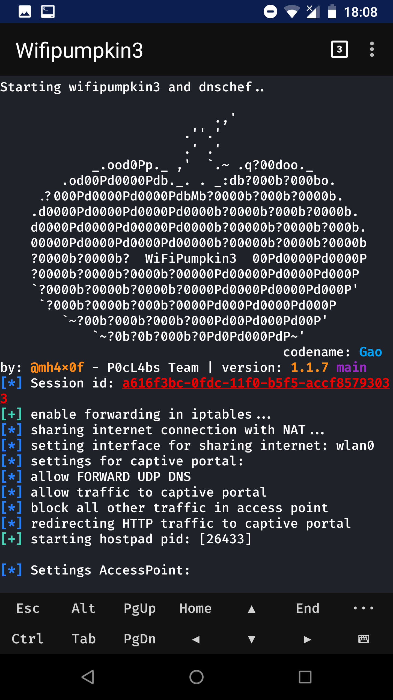

# Kali NetHunter: il laboratorio di pentesting in tasca

*Un tempo la situazione era diversa: le aziende di cybersecurity quasi non si vedevano. Nel 2014 ero quasi l’unico a girare per il paese con un telefono e un’antenna TP-Link TL-WN722N — io, il telefono e una piccola antenna, a curiosare reti e imparare sul campo. Oggi quel setup è molto più maturo: Kali NetHunter porta tutto quel potenziale direttamente sullo smartphone.*  

Quando si parla di **hacking portatile**, il nome che spicca è senza dubbio **Kali NetHunter**. Nato dal progetto Kali Linux di Offensive Security, NetHunter è la prima piattaforma **open source di penetration testing per Android**. In pratica, trasforma il tuo smartphone in un laboratorio di sicurezza completo, con strumenti avanzati per testare reti, dispositivi wireless e molto altro.  

---

## Cos’è Kali NetHunter?

NetHunter è una versione personalizzata di **Kali Linux ottimizzata per Android**. Si installa su dispositivi supportati (nativamente o tramite Magisk/Kernel personalizzati) e permette di eseguire:  

- **Wireless Attacks**: supporto a modalità monitor e injection su schede Wi-Fi compatibili.  
- **USB HID attacks (BadUSB)**: il telefono si comporta come una tastiera/mouse e inietta comandi.  
- **Evil AP (Access Point)**: creazione di hotspot malevoli per intercettare traffico.  
- **Port scanning & exploitation** con tutti i tool classici di Kali.  

In sostanza, offre la potenza di Kali, ma con la portabilità e discrezione di uno smartphone.  

---

## Versioni disponibili

NetHunter è disponibile in diverse varianti:  

- **NetHunter Rooted**: la versione completa, richiede root e un kernel custom.  
- **NetHunter Lite**: per chi non vuole ricompilare kernel, ma desidera i tool e l’interfaccia.  
- **NetHunter Rootless**: funziona senza root, più limitata ma ideale per iniziare.  

---

## Perché usare Kali NetHunter?

I vantaggi principali:  

- **Portabilità**: puoi fare test direttamente dal telefono.  
- **Integrazione**: HID attacks, MITM, sniffing, tutto in un unico dispositivo.  
- **Open Source**: trasparente, mantenuto dalla community di Kali.  

È perfetto per **ricercatori di sicurezza, pentester e appassionati**, ma richiede consapevolezza: come ogni strumento di pentesting, deve essere usato in **ambito legale ed etico**.  

---

 *"In un mio video su LinkedIn ho mostrato quanto sia rischioso utilizzare reti Wi-Fi aperte in centro: un malintenzionato può usare facilmente il proprio smartphone con Kali e ottenere gli stessi risultati grazie a questo tool."*

---

Prima di avviare il falso Access Point, possiamo scegliere il captive portal che verrà mostrato agli utenti che si connettono alla rete.

👉  Continua nella prossima parte!

