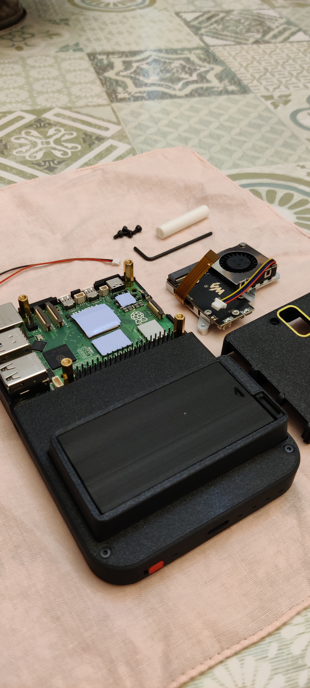

Fin da quando ho iniziato a smanettare con l’hardware e il software, ho sempre avuto un pallino: avere un computerino portatile tutto mio, compatto ma potente, da portare ovunque per sperimentare, testare e divertirsi con progetti di rete, radio e pentesting.

Negli anni ho provato di tutto: mini PC, notebook, single board computer di ogni tipo. Ho passato ore a cercare l’equilibrio tra prestazioni, consumi e portabilità — quel mix perfetto che permettesse di avere un laboratorio tascabile, pronto all’uso in qualsiasi momento.

Dalla teoria alla pratica

Tra adattatori, batterie powerbank e display portatili, ho costruito e smontato tanti piccoli sistemi, ma nessuno mi ha mai convinto del tutto.
Ogni volta c’era qualcosa che mancava: troppi consumi, poca potenza, compatibilità limitata o semplicemente troppo ingombro.

A un certo punto, avevo addirittura iniziato a progettare un mio computer portatile personalizzato, con tre batterie da almeno 9000 mAh complessivi per garantire un’autonomia seria e una struttura compatta, modulare, pensata proprio per l’uso “sul campo”.
Purtroppo, per motivi di tempo, quel progetto è rimasto in pausa… ma non è dimenticato.

L’arrivo dell’HackberryPi

E poi… ci siamo arrivati.
Di recente mi sono finalmente deciso a fare un passo avanti serio e mi sono comprato un HackberryPi 5 e un HackberryPi Zero 2 W. 
Entrambi basati rispettivamente su Raspberry Pi 5 e Raspberry Pi Zero 2 W.
Due piccole meraviglie di potenza e versatilità che, insieme, rappresentano esattamente ciò che cercavo da tempo: un sistema leggero, modulare e perfettamente adatto ai miei esperimenti con Wi-Fi, Bluetooth e SDR.

HackberryPi:
Display : display TFT ad alta risoluzione da 4" 720X720 con funzione multi-touch.
Tipo di batteria : 2 batterie 18650
Durata della batteria : se utilizzato con 2 batterie 18650 da 3000 mAh, questo dispositivo può funzionare fino a 3-4 ore senza ricarica.
Altoparlanti stereo integrati : questo dispositivo è integrato con altoparlanti Bluetooth integrati, puoi connetterti ad esso per riprodurre il suono.

continua ...