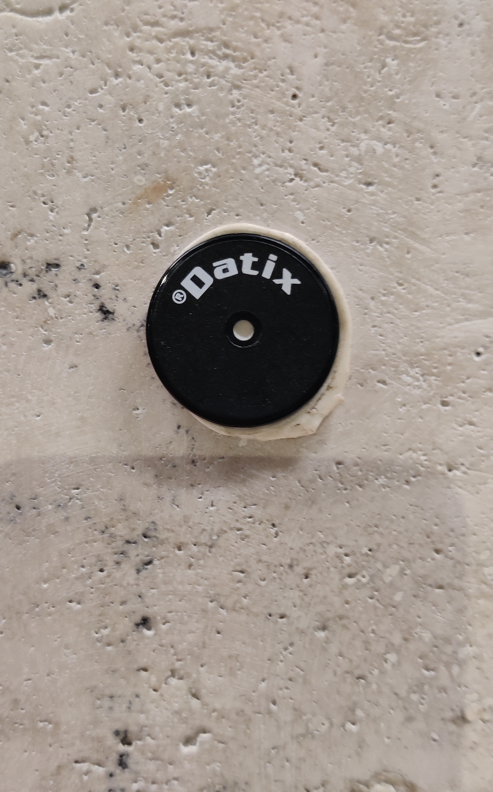

In questo articolo, esploreremo come clonare un tag RFID utilizzando il Flipper Zero e come emularlo successivamente. 


Facciamo un esempio pratico: immaginiamo un vigilante in servizio che deve completare vari giri di ronda, smarcando i tag RFID che si trovano in diversi punti.
Come mostrato nell'immagine sottostante, con il Flipper Zero e un po' di astuzia, qualcuno potrebbe teoricamente "imbrogliare" e non effettuare il giro di ispezione reale.


## Foto Datix



## Guarda il video di esempio

[Guarda il video](https://www.dropbox.com/scl/fi/fsbv5di2e95ypzttv3nuu/Rfid.mp4?rlkey=ol4msudke6g4dgaf6qiewvpaq&e=1&st=h60vbejw&dl=0)

"Alcuni istituti adottano l'applicazione SICEP sui dispositivi mobili, la quale non consente di aggirare il sistema poiché registra la posizione GPS."


```markdown

```
Questo articolo è a scopo divulgativo e dimostrativo, per evidenziare i rischi associati alla sicurezza dei sistemi RFID. 
L'esempio pratico che abbiamo esplorato con il Flipper Zero non intende incoraggiare attività illecite, ma piuttosto sensibilizzare sull'importanza di proteggere e monitorare adeguatamente questi sistemi, evidenziando la necessità di soluzioni più sicure per prevenire possibili abusi.


Grazie per aver letto.
