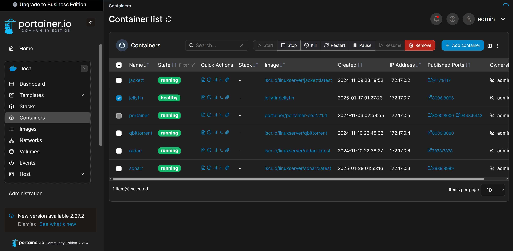

## Come ho creato un server multimediale con Raspberry Pi 4 e Jellyfin

# Introduzione

Volevo un server multimediale leggero, efficiente e open-source per gestire la mia libreria di film e serie TV. 
Ho scelto Jellyfin perché offre ottime funzionalità senza richiedere licenze a pagamento.
In questo articolo, spiegherò come ho configurato il mio server usando un Raspberry Pi 4.


# Hardware utilizzato

• Raspberry Pi 4B (4GB di RAM)

• MicroSD (per il sistema operativo) 

• HDD esterno da 2TB (per i file multimediali) (facoltativo)

• Mini Tower NAS kit ZP-0130 (facoltativo)

# Installazione del sistema operativo

Per mantenere il sistema il più leggero e performante possibile, ho scelto di installare Raspberry Pi OS Lite. Questa versione senza interfaccia grafica consente di gestire il server in modo efficiente tramite SSH, senza caricare risorse inutili.
Tuttavia, se preferisci un'interfaccia grafica, puoi optare per la versione Raspberry Pi OS con Desktop, che offre un ambiente grafico completo, perfetto se desideri un'esperienza più interattiva e visiva.

Ho scaricato l'ultima versione di Raspberry Pi OS Lite dal sito ufficiale.

Ho usato Raspberry Pi Imager per scrivere l'immagine sulla microSD.

Dopo aver configurato la rete direttamente dal Raspberry Pi collegato a uno schermo e a una tastiera, ed aver aggiornato il sistema con:
```bash
sudo apt update && sudo apt upgrade -y
```


## Installazione di Docker

Per migliorare la gestione delle applicazioni, ho deciso di installare Docker sul Raspberry Pi. 
Ora puoi procedere con l'installazione di Docker e Docker Compose. 
Aggiunta del repository Docker:
```bash
printf '%s\n' "deb https://download.docker.com/linux/debian bullseye stable" | sudo tee /etc/apt/sources.list.d/docker-ce.list
```
Importazione della chiave GPG ufficiale:
```bash
curl -fsSL https://download.docker.com/linux/debian/gpg | sudo gpg --dearmor -o /etc/apt/trusted.gpg.d/docker-ce-archive-keyring.gpg
```

Installazione di Docker:
```bash
sudo apt-get update
sudo apt install -y docker-ce docker-ce-cli containerd.io
```

## Installazione e configurazione di Portainer



Per semplificare la gestione dei container, ho installato Portainer, un'interfaccia grafica per Docker.

Creazione del volume per i dati di Portainer:
```bash
sudo docker volume create portainer_data
```
Avvio del container Portainer:
```bash
sudo docker run -d -p 8000:8000 -p 9443:9443 --name portainer --restart=always \
  -v /var/run/docker.sock:/var/run/docker.sock \
  -v portainer_data:/data portainer/portainer-ce:2.21.4
```


## Installazione e configurazione di Jellyfin
Per configurare Jellyfin come server multimediale, ho seguito questi passaggi:

Creazione delle cartelle necessarie
Prima di avviare il container, ho creato le seguenti cartelle per la configurazione, la cache e i media:

```bash
mkdir -p ~/jellyfin_config
mkdir -p ~/jellyfin_cache
mkdir -p ~/media
```
## Scaricamento e Avvio del Container Jellyfin

```bash
docker run -d \
  --name jellyfin \
  -p 8096:8096 \
  -v ~/docker_apps/jellyfin/config:/config \
  -v ~/docker_apps/jellyfin/cache:/cache \
  -v ~/docker_apps/media:/media \
  --restart always \
  jellyfin/jellyfin
```

## Esempio dei miei container Docker


## Configurazione di Jellyfin
Una volta che il container di Jellyfin è stato avviato con successo, non ci resta che completare la configurazione iniziale.

Accedi all'interfaccia web di Jellyfin:
Apri il tuo browser e vai all'indirizzo http://<indirizzo-ip-del-raspberry-pi>:8096

Configurazione guidata:
Quando accedi per la prima volta, Jellyfin ti guiderà attraverso il processo di configurazione. Ti verrà chiesto di configurare le cartelle per i tuoi media, di creare un account amministratore e di scegliere le preferenze di sistema.

Aggiungi i tuoi contenuti:
Durante la configurazione, puoi aggiungere le cartelle contenenti i tuoi film, serie TV, musica e altri contenuti multimediali, che sono stati precedentemente montati nei volumi del container (~/docker_apps/media).

Completa la configurazione:
Una volta configurato, potrai iniziare a utilizzare Jellyfin per gestire e riprodurre i tuoi contenuti multimediali.

Con questa configurazione, Jellyfin sarà pronto per essere utilizzato e potrai accedere al server multimediale da qualsiasi dispositivo sulla tua rete.

## Conclusione e supporto
Jellyfin è ora configurato e pronto per essere utilizzato come server multimediale sul tuo Raspberry Pi. Se hai problemi con l'installazione o hai bisogno di supporto, puoi contattarmi via email a cri90.cg@gmail.com. Sarò felice di aiutarti! 😊