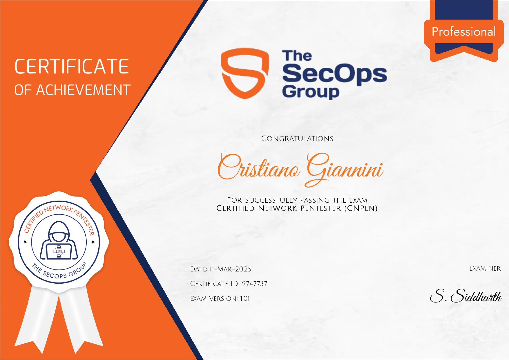

## Sono felice di annunciare che ho recentemente ottenuto la certificazione Certified Network Pentester (CNPen) 🎉

Questa certificazione pratica comprende competenze avanzate nell'identificazione e nello sfruttamento delle vulnerabilità, attacchi a Windows Active Directory, tecniche di movimento laterale, attacchi alle password, dumping delle credenziali di sistema, escalation dei privilegi tramite configurazioni di sicurezza errate, sfruttamento di protocollo non sicuri e vulnerabilità nei sistemi Unix, e molto altro.

Inoltre, ho acquisito una profonda comprensione delle tecniche di OSINT, mappatura delle reti e identificazione dei target, e ho affinato l'uso di strumenti di hacking comuni per testare e proteggere le reti aziendali. Questa certificazione mi ha fornito le competenze necessarie per eseguire test di penetrazione avanzati e affrontare le sfide più complesse nella sicurezza delle reti aziendali.

[Certificate Validation](https://secops.group/certificate-validation/)

